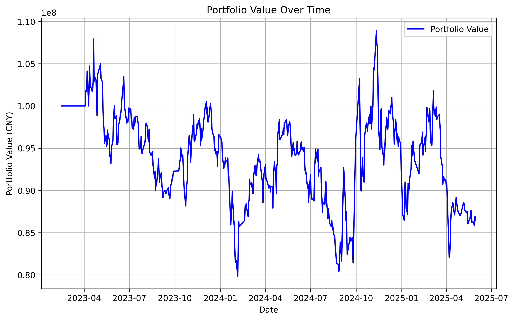

## Backtrader介绍

`Backtrader` 以大脑 `cerebro` 为统一的调度中心，数据、策略、回测条件等信息都会导入 `cerebro` 中，并由 `cerebro` 启动和完成回测，最后返回回测结果

- 架构如下:
```
Cerebro
├── DataFeeds (数据模块)
│   ├── CSVDataBase 导入CSV
│   ├── PandasData 导入 df
│   └── YahooFinanceData 导入网站数据 ...
├── Strategy (策略模块)
│   ├── next() 主策略函数
│   ├── notify_order、notify_trade 打印订单、交易信息 ...
├── Indicators (指标模块)
│   ├── SMA、EMA 移动均线
│   └── Ta-lib 技术指标库 ...
├── Orders (订单模块)
│   ├── buy() 买入
│   ├── sell() 卖出
│   ├── close() 平仓
│   └── cancel() 取消订单 ...
├── Sizers (仓位模块)
├── Broker (经纪商模块)
│   ├── cash 初始资金
│   ├── commission 手续费
│   └── slippage 滑点 ...
├── Analyzers (策略分析模块)
│   ├── AnnualReturn 年化收益
│   ├── SharpeRatio 夏普比率
│   ├── DrawDown 回撤
│   └── PyFolio 分析工具 ...
└── Observers (观测器模块)
    ├── Broker 资金\市值曲线
    ├── Trades 盈亏曲线
    └── BuySell 买卖点
```

#### 术语解释

- **回测**  
  回测是指利用历史市场数据（如价格、成交量等）模拟交易策略的表现，以评估其在过去市场环境下的潜在收益、风险和稳定性。在Backtrader中，回测通过加载历史数据（如CSV或在线数据源）、定义交易策略逻辑、设置初始资金和交易规则（如佣金、滑点）来执行。回测结果包括净值曲线、收益率、最大回撤等指标，帮助优化策略，但需注意历史数据质量和过拟合风险。

- **滑点**  
  滑点是指实际成交价格与预期成交价格之间的差额，通常由市场流动性不足、价格波动或交易延迟引起。在Backtrader中，滑点可以通过设置`slippage`参数模拟，例如固定滑点（固定价格差）或百分比滑点（按成交金额比例）。滑点的引入使回测更贴近真实交易环境，特别是在高频交易或低流动性市场中，需合理设置以避免过于乐观的回测结果。

- **策略**  
  策略是量化交易的核心，定义了基于市场数据（如K线、指标）进行买入、卖出或持仓的逻辑规则。在Backtrader中，策略通过继承`bt.Strategy`类实现，包含`next()`方法处理每根K线的决策逻辑，以及可选的`notify_order()`和`notify_trade()`方法监控订单和交易状态。策略可结合技术指标（如移动平均线、RSI）、资金管理（如固定比例下单）和风险控制（如止损止盈）设计。

- **中证500成分股**
  中证500成分股是指中证500指数的构成股票，由中证指数有限公司编制，选取A股市场中剔除沪深300指数成分股及总市值排名前300的股票后，总市值排名靠前的500只中小市值股票组成。这些股票代表中国A股市场中等市值公司的整体表现，覆盖多个行业，流通市值较中小盘股为主。在Backtrader回测中，可使用中证500成分股的历史数据（如通过Yahoo Finance或东方财富获取）进行策略测试，以评估策略在中小市值股票市场中的表现。成分股每半年调整一次（6月和12月），需注意调整对策略的影响。

- **复权**
  在股票交易中，分红送股、配股、转增股本 等行为会导致股价发生“非市场性”的变化（即不是因为买卖导致的涨跌）。为了更真实地反映股票的历史价格走势，就需要对这些历史价格进行调整，这个过程就叫做 复权 。
  - 前复权==>以当前最新的收盘价为基准，把以前的所有历史价格都按照分红送股的比例进行调整
  >某股票在2023年1月1日价格是10元，之后进行了10送10股（也就是1股变2股），那么如果不复权，除权后的价格会变成5元。但用**前复权**处理后，1月1日的价格会被调整成5元，而现在的价格保持不变。

  - 后复权==>以最初的历史价格为基准，把之后所有价格按照分红送股比例调整。
  >是上面的例子，如果使用**后复权**，则1月1日的价格保持10元不变，而除权后的价格会被调整成10元、11元、12元等，体现的是持有至今的真实收益情况。
  
  | 特点 | 前复权 | 后复权 |
  |------|--------|--------|
  | 基准点 | 当前价格不变 | 初始价格不变 |
  | 用途 | 技术分析、K线图观察 | 收益计算、长期回报分析 |
  | 图形表现 | 看起来像是“连续”的 | 显示出真实的累计涨幅 |

- **双边佣金**
  在买入和卖出证券时都需要支付的手续费
  1. 买入时佣金：
   $$
   10,000 \text{股} \times 10 \text{元} \times 0.025\% = 25 \text{元}
   $$
  2. 卖出时佣金：
   $$
   10,000 \text{股} \times 12 \text{元} \times 0.025\% = 30 \text{元}
   $$
  3. 总佣金成本：
   $$
   25 + 30 = 55 \text{元}
   $$

- **未平仓合约量**
  `openinterest`主要用于期货和期权市场的术语。它代表在一天交易结束时，市场上所有尚未被平仓（即尚未通过反向操作了结，或进行实物交割）的合约总数。
  1. 交易量 (Volume)：统计在特定时间内（如一天）买卖双方总共成交了多少合约。它衡量的是市场的活跃度。
  2. 未平仓合约量 (Open Interest)：统计在某个时间点，市场上还“欠着”多少未了结的合约。它衡量的是流入或流出该市场的资金量。
  3. 股票市场没有“未平仓合约”这个概念。买入股票，就是持有股份；卖出股票，就是转让股份。所以对于股票数据来说，openinterest 永远是0。

#### 通常的回测流程

- 构建策略
    - 确定策略潜在的可调参数
    - 计算策略中用于生成交易信号的指标
    - 按需打印交易信息
    - 编写买入、卖出的交易逻辑
- 实例化`cerebro`==>驱动回测
    - 由 DataFeeds 加载数据，再将加载的数据添加给 cerebro
    - 将上一步生成的策略添加给 cerebro
    - 按需添加策略分析指标或观测器
    - 通过运行 cerebro.run() 来启动回测
    - 回测完成后，按需运行 cerebro.plot() 进行回测结果可视化展示


```
+-------------------+                       +-------------------+
| 1. 准备回测数据   |                       | 4. 设置回测参数   |
+-------------------+                       +-------------------+
          \                                       /
           \                                     /
            v                                   v
+-------------------+                       +-------------------+
| 2. 编写策略       |                       | 5. 设置绩效分析指标|
+-------------------+                       +-------------------+
          \                                       /
           \                                     /
            v                                   v
                    +-------------------+  
                    | 3. 实例化         |  
                    | cerebro = Cerebro()|   
                    +-------------------+  
                            |                                       
                            |                                     
                            v                                   
                    +-------------------+                       
                    | 6. 运行回测       |                      
                    | cerebro.run()     |                     
                    +-------------------+        
                            |                                       
                            |                                     
                            v                                   
                    +-------------------+   
                    | 7. 获得回测结果   |   
                    +-------------------+  
```

#### 选股回测流程示例

实例化大脑 → 导入数据 → 配置回测条件 → 编写交易逻辑 → 运行回测 → 提取回测结果 

```python
import backtrader as bt
import backtrader.indicators as btind

# 创建策略
class TestStrategy(bt.Strategy):
    params = (
        ('maperiod', 20),  # 移动均线周期，示例设为20
    )

    def log(self, txt, dt=None):
        '''打印日志'''
        dt = dt or self.datas[0].datetime.date(0)
        print(f'{dt.isoformat()}, {txt}')

    def __init__(self):
        '''初始化属性和指标'''
        # 计算简单移动均线
        self.sma = btind.SimpleMovingAverage(self.datas[0].close, period=self.params.maperiod)
        # 跟踪订单状态
        self.order = None

    def notify_order(self, order):
        '''处理订单状态'''
        if order.status in [order.Completed]:
            if order.isbuy():
                self.log(f'买入执行, 价格: {order.executed.price:.2f}, 数量: {order.executed.size}')
            elif order.issell():
                self.log(f'卖出执行, 价格: {order.executed.price:.2f}, 数量: {order.executed.size}')
            self.order = None  # 重置订单状态

    def next(self):
        '''交易逻辑'''
        if self.order:  # 检查是否有未完成订单
            return

        # 示例策略：价格突破均线买入，跌破均线卖出
        if not self.position:  # 没有持仓
            if self.datas[0].close[0] > self.sma[0]:
                self.order = self.buy(size=100)  # 买入100股
                self.log('发出买入信号')
        else:
            if self.datas[0].close[0] < self.sma[0]:
                self.order = self.sell(size=100)  # 卖出100股
                self.log('发出卖出信号')

# 实例化Cerebro引擎
cerebro = bt.Cerebro()

# 加载数据
data = bt.feeds.YahooFinanceCSVData(
    dataname='data.csv',
    fromdate=datetime.datetime(2020, 1, 1),
    todate=datetime.datetime(2023, 12, 31)
)
cerebro.adddata(data)

# 通过经纪商设置初始资金
cerebro.broker.setcash(100000.0)  # 初始资金10万

# 设置交易单位（固定100股）
cerebro.addsizer(bt.sizers.FixedSize, stake=100)

# 设置佣金（示例：0.1%）
cerebro.broker.setcommission(commission=0.001)

# 添加策略
cerebro.addstrategy(TestStrategy)

# 添加分析指标（如夏普比率、年化收益率）
cerebro.addanalyzer(bt.analyzers.SharpeRatio, _name='sharpe')
cerebro.addanalyzer(bt.analyzers.DrawDown, _name='drawdown')
cerebro.addanalyzer(bt.analyzers.Returns, _name='returns')

# 运行回测
results = cerebro.run()

# 打印分析结果
strat = results[0]
print(f"夏普比率: {strat.analyzers.sharpe.get_analysis()['sharperatio']:.2f}")
print(f"最大回撤: {strat.analyzers.drawdown.get_analysis()['max']['drawdown']:.2f}%")
print(f"总收益率: {strat.analyzers.returns.get_analysis()['rtot']*100:.2f}%")

# 可视化结果
cerebro.plot()
```

#### 实战回测

##### 策略1说明

0. 固定好最开始的 500 支股票不变
1. 按收益率降序排序，最开始选择 2023-01 收益前 20% 的股票
2. 在每月最后一个交易日，计算成分股上个月的收益率(使用**前复权数据**)
3. 在每月第一个交易日，以开盘价清仓旧持仓并买入新选股
4. 持仓权重根据上月收益率加权数据分配
5. 考虑 0.03% 双边佣金和 0.01% 双边滑点
6. 添加年化收益率,交易次数/换手率,夏普比率,最大回撤和总回报分析器
7. 输出回测结果并可视化净值曲线

| 股票池         | 中证 500 成分股。 |
|----------------|--------------------|
| 回测区间       | 2023-02-01 至 2025-06-01。 |
| 持仓周期       | 月度调仓，每月第一个交易日，以开盘价买入或卖出。 |
| 持仓权重       | 上月收益率加权 |
| 总资产         | 100,000,000 元。 |
| 佣金           | 0.0003 双边。 |
| 滑点           | 0.0001 双边。 |
| 策略逻辑       | 每次选择中证 500 成分股中表现最优的前 20% 的股票作为下一个月的持仓成分股，然后在下个月的第一个交易日，卖出已有持仓，买入新的持仓。 |


##### 策略2说明

通过分析大跌后的次日反弹行情，捕捉市场短期反弹机会，实现稳定盈利。

1. 收集最近5年的沪深300ETF（510300）每日行情数据。
2. 筛选出当日收盘价下跌的交易日。
3. 统计次日（即T+1日）的行情表现，包括：
   - 涨跌幅分布
   - 平均收益率
   - 胜率（次日上涨的概率）
   - 最大/最小收益率
4. 基于统计结果，识别具有稳定盈利潜力的操作模式，例如：
   - 确定触发条件（如跌幅超过某阈值）。
   - 在次日开盘价买入，并在收盘价卖出。
5. 制定交易规则，确保策略在回测中考虑实际交易成本。

| 数据源         | 沪深300ETF每日行情数据。 |
|----------------|-----------------------------------------|
| 数据周期       | 最近5年（2020-06-01 至 2025-06-01）。   |
| 数据内容       | 开盘价、收盘价、最高价、最低价、成交量。 |
| 数据类型       | 前复权价格数据。                        |

---

- 获取中证 500 成分股数据
  
```python
import pandas as pd
import akshare as ak

column_mapping = {
    "日期": "date",
    "指数代码": "index_code",
    "指数名称": "index_name",
    "指数英文名称": "index_english_name",
    "成分券代码": "stock_code",
    "成分券名称": "stock_name",
    "成分券英文名称": "stock_english_name",
    "交易所": "exchange",
    "交易所英文名称": "exchange_english_name",
}

def get_csi500_stocks(date):
    """获取指定日期的中证 500 成分股列表"""
    try:
        csi500 = ak.index_stock_cons_csindex(symbol="000905")
        csi500.rename(columns=column_mapping, inplace=True)
        csi500["date"] = pd.to_datetime(csi500["date"])
        latest_date = csi500["date"].max()
        latest_stocks = csi500[csi500["date"] == latest_date]
        print(f"使用最新成分股数据，日期为：{latest_date.strftime('%Y-%m-%d')}")
        return latest_stocks[["stock_code", "stock_name"]].values.tolist()
    except Exception as e:
        print(f"获取中证 500 成分股失败: {e}")
        return []

stocks = get_csi500_stocks("2023-12-01")
if not stocks:
    print("无法获取中证 500 成分股")
else:
    print(f"获取到 {len(stocks)} 只中证 500 成分股")
    print(stocks[:2])
```

```
使用最新成分股数据，日期为：2025-06-17
获取到 500 只中证 500 成分股
[['000009', '中国宝安'], ['000021', '深科技']]
```

- 获取交易日历
```python
import pandas as pd
import akshare as ak

def get_trading_days(start_date, end_date):
    """使用上证指数获取交易日历"""
    calendar = ak.stock_zh_index_daily(symbol="sh000001")
    calendar["date"] = pd.to_datetime(calendar["date"])
    calendar = calendar[
        (calendar["date"] >= start_date) & (calendar["date"] <= end_date)
    ]
    return calendar["date"].tolist()

trading_days = get_trading_days(
    pd.to_datetime("2023-12-01"), pd.to_datetime("2025-06-01")
)
if not trading_days:
    print("无法获取交易日历")
else:
    print(f"获取到 {len(trading_days)} 个交易日")
    # 打印前5个交易日
    print(trading_days[:2])
```

```
获取到 360 个交易日
[Timestamp('2023-12-01 00:00:00'), Timestamp('2023-12-04 00:00:00')]
```

- 500只股票日度行情数据集

```python
import pandas as pd
import akshare as ak

column_mapping = {
    "日期": "date",
    "开盘": "open",
    "收盘": "close",
    "最高": "high",
    "最低": "low",
    "成交量": "volume",
    "成交额": "amount",
    "振幅": "amplitude",
    "涨跌幅": "change_pct",
    "涨跌额": "change",
    "换手率": "turnover",
    "指数代码": "index_code",
    "指数名称": "index_name",
    "指数英文名称": "index_english_name",
    "成分券代码": "stock_code",
    "成分券名称": "stock_name",
    "成分券英文名称": "stock_english_name",
    "交易所": "exchange",
    "交易所英文名称": "exchange_english_name",
}

def get_daily_data(stock_code, start_date, end_date):
    """获取单只股票的日频行情数据"""
    try:
        # A股日线行情接口
        df = ak.stock_zh_a_hist(
            symbol=stock_code,
            period="daily",
            start_date=start_date,
            end_date=end_date,
            adjust="hfq",
        )
        df.rename(columns=column_mapping, inplace=True)
        if len(df) > 0:
            df["stock_code"] = stock_code
            return df[
                [
                    "date",
                    "stock_code",
                    "open",
                    "high",
                    "low",
                    "close",
                    "volume",
                    "amount",
                    "amplitude",
                    "change_pct",
                    "change",
                    "turnover",
                ]
            ]
        else:
            print(f"{stock_code} 没有获取到数据")
            return pd.DataFrame()
    except Exception as e:
        print(f"获取 {stock_code} 数据失败: {e}")
        return []

xx = get_daily_data("000009", "20231201", "20250601")
if len(xx) > 0:
    print(f"获取到 {xx.shape[0]} 条数据")
    print(xx.head())
else:
    print("没有获取到数据")
```

```
获取到 360 条数据
         date stock_code    open    high     low   close  volume        amount  amplitude  change_pct  change  turnover
0  2023-12-01     000009  115.04  115.04  112.15  112.25  217638  2.513519e+08       2.53       -1.60   -1.83      0.85
1  2023-12-04     000009  112.15  114.36  112.15  113.98  178776  2.085234e+08       1.97        1.54    1.73      0.70
2  2023-12-05     000009  113.60  114.84  113.02  113.50  133102  1.555206e+08       1.60       -0.42   -0.48      0.52
3  2023-12-06     000009  113.31  114.94  112.92  114.36  161783  1.893744e+08       1.78        0.76    0.86      0.63
4  2023-12-07     000009  114.08  115.33  113.60  114.94  143561  1.685995e+08       1.51        0.51    0.58      0.56
```

- 导入 backtrader

```python
import backtrader as bt  # 导入 Backtrader

# 实例化 cerebro
cerebro = bt.Cerebro()

# 设置初始资金、佣金和滑点
cerebro.broker.setcash(100_000_000)
cerebro.broker.setcommission(commission=0.0003)
cerebro.broker.set_slippage_perc(0.0001)

# 打印初始资金
print("Starting Portfolio Value: %.2f" % cerebro.broker.getvalue())
# 启动回测
cerebro.run()
# 打印回测完成后的资金
print("Final Portfolio Value: %.2f" % cerebro.broker.getvalue())
```

```
Starting Portfolio Value: 100000000.00
Final Portfolio Value: 100000000.00
```

- 编写交易策略

```python
# 通过继承 Strategy 基类，来构建自己的交易策略子类
class MyStrategy(bt.Strategy):
    def __init__(self):
        '''必选，指标的创建、数据的引用、变量的初始化等'''
        super().__init__()
        pass
    def next(self, ctx):
        '''必选，每次接收到新的 Bar (K线) 数据时运行 策略的核心逻辑'''
        pass
    def next_open(self, ctx):
        '''可选。当所有数据源都收到新的**开盘价**数据时调用'''
        pass
    def log(self, txt, dt=None, doprint=True):
        '''可选，构建策略打印日志的函数：可用于打印订单记录或交易记录等'''
        pass
    def notify_order(self, order):
        '''可选，打印订单信息'''
        pass
    def notify_trade(self, trade):
        '''可选，打印交易信息'''
        pass
    def stop(self):
        '''
        可选。回测结束时调用，用于打印最终结果，如最终账户价值等'''
        pass
```

---

#### 策略一开始回测

```python
class MonthlyStrategy(bt.Strategy):
    """
    月度动量策略
    1. 在每月最后一个交易日，计算过去一个月的收益率
    2. 筛选出收益率排名前20%的股票
    3. 根据收益率进行加权，作为新持仓的目标权重
    4. 在下一个交易日（即下月第一个交易日）以开盘价执行调仓
    """

    params = (
        ("top_n_percent", 0.20),  # 选择前20%
        ("rebalance_dates", None),  # 传入每月最后一个交易日列表
        ("lookback_period", 20),  # 代表约一个月的交易日
    )

    def __init__(self):
        super().__init__()
        # 将传入的 pandas Timestamps 转换为 python datetime.date 对象，便于比较
        self.rebalance_dates = [
            d.to_pydatetime().date() for d in self.p.rebalance_dates
        ]

        # 核心修改：引入状态标志位和目标持仓字典
        self.rebalance_due = False  # 是否有待执行的调仓任务
        self.target_weights = {}  # 储存计算出的目标权重

        # 使用 self.datetime 访问当前时间点
        self.datetime = self.datas[0].datetime

    def next(self):
        # 获取当前的回测日期
        current_date = self.datetime.date(0)

        # --- 1. 交易执行模块 ---
        # 检查是否有待处理的调仓任务。
        # 这个模块总是在信号生成模块之前，确保在计算新信号前，完成上一期的交易。
        if self.rebalance_due:
            print(f"--- {current_date}: 执行调仓 ---")

            # 获取当前持仓的股票代码集合
            current_holdings = {
                d._name for d, pos in self.getpositions().items() if pos.size > 0
            }

            # 获取目标持仓的股票代码集合
            target_stocks = set(self.target_weights.keys())

            # 卖出：当前持有但不在目标中的股票，仓位调整为0
            stocks_to_sell = current_holdings - target_stocks
            for stock_code in stocks_to_sell:
                data = self.getdatabyname(stock_code)
                self.order_target_percent(data=data, target=0.0)
                print(f"  [清仓] {stock_code}")

            # 买入/调仓：目标持仓中的股票，调整至目标权重
            # 这也会自动处理从较低权重调整到较高权重的情况
            for stock_code, weight in self.target_weights.items():
                data = self.getdatabyname(stock_code)
                self.order_target_percent(data=data, target=weight)
                print(f"  [买入/调仓] {stock_code}, 目标权重: {weight:.4f}")

            # 任务完成，重置标志位和目标权重
            self.rebalance_due = False
            self.target_weights.clear()
            return  # 当天执行完交易后，不再做其他操作

        # --- 2. 信号生成模块 ---
        # 检查今天是否是需要计算信号的调仓准备日（即每月的最后一个交易日）
        if current_date in self.rebalance_dates:
            print(f"--- {current_date}: 计算下月持仓信号 ---")

            # 1. 计算所有股票的动量（上月回报）
            returns = {}
            for d in self.datas:
                # 确保数据长度足够进行计算
                if len(d) > self.p.lookback_period:
                    try:
                        # (今日收盘 / N日前收盘) - 1
                        momentum = (d.close[0] / d.close[-self.p.lookback_period]) - 1
                        returns[d._name] = momentum
                    except IndexError:
                        # 理论上 len(d) 检查后不会触发，但作为保险
                        continue

            if not returns:
                print("警告：没有足够的数据来计算回报。")
                return

            # 2. 降序排序并选择前 N% 的股票
            sorted_stocks = sorted(returns.items(), key=lambda x: x[1], reverse=True)
            top_n = int(len(sorted_stocks) * self.p.top_n_percent)

            # 筛选出收益率排名前列的股票，并且只保留正收益的股票进行加权
            top_performers = [item for item in sorted_stocks[:top_n] if item[1] > 0]

            if not top_performers:
                print(
                    f"警告：在 {current_date}，排名前 {self.p.top_n_percent:.0%} 的股票均为负收益，将执行空仓。"
                )
                self.target_weights.clear()  # 确保目标为空
                self.rebalance_due = True  # 设置标志，以便下一天卖出所有现有持仓
                return

            # 3. 计算收益率加权
            positive_return_sum = sum(r for d, r in top_performers)

            # 临时存储计算出的权重
            temp_weights = {}
            if positive_return_sum > 0:
                for d_name, r in top_performers:
                    temp_weights[d_name] = r / positive_return_sum

            # 4. 保存计算结果，并设置标志位以便下一天执行
            if temp_weights:
                self.target_weights = temp_weights
                self.rebalance_due = True  # 核心：设置调仓标志！
                print(
                    f"信号生成完毕，准备在下一个交易日调仓。选出 {len(self.target_weights)} 只股票。"
                )

    def stop(self):
        print("--- 回测结束 ---")
        print(f"最终资产价值: {self.broker.getvalue():,.2f}")
```

- 打印回测日志

```
--- 回测结束 ---
最终资产价值: 89,628,114.29

=============== 回测结果分析 ===============
回测区间: 2023-02-01 to 2025-06-01
初始资产: 100,000,000.00
最终资产: 89,628,114.29
总回报率: -10.37%
年化收益率: -4.77%
最大回撤: 25.41%
年化夏普比率 (无风险利率 2%): -0.2052
总交易次数: 887
总交易额: 15,656,298.89
估算月均换手率: 0.60%
```

- 回测结果




### 展望

很多细节未做深入讲解,下一节继续,可以看看

- z_using_files/backtrader_code/strategy_01.py

### Refernce

- [Backtrader来了](https://mp.weixin.qq.com/mp/appmsgalbum?__biz=MzAxNTc0Mjg0Mg==&action=getalbum&album_id=2380299870701420545)
- [Backtrader-01](https://mp.weixin.qq.com/s/7S4AnbUfQy2kCZhuFN1dZw)
- 
